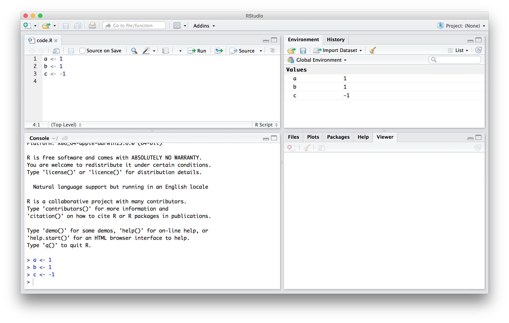

```{r setup, include=FALSE}
knitr::opts_chunk$set(echo = TRUE, fig.align="center")
img_path <- "rFigs/"
library(tidyverse)
library(ggplot2)
#library(ggflags)
library(countrycode)
```

##  Case study: US Gun Murders

Imagine you are trying to use a data-driven approach to deciding your opinion on gun regulations. In the process you notice the following trends:

```{r murder-rate-example-1, echo=FALSE, warning=FALSE, message=FALSE, out.width="60%"}
##from http://abcnews.go.com/images/International/homocides_g8_countries_640x360_wmain.jpg
##knitr::include_graphics(file.path(img_path,"homocides_g8_countries_640x360_wmain.jpg"))

dat <- tibble(country = toupper(c("US", "Italy", "Canada", "UK", "Japan", "Germany", "France", "Russia")),
              count = c(3.2, 0.71, 0.5, 0.1, 0, 0.2, 0.1, 0),
              label = c(as.character(c(3.2, 0.71, 0.5, 0.1, 0, 0.2, 0.1)), "No Data"),
             code = c("us", "it", "ca", "gb", "jp", "de", "fr", "ru"))


dat %>% 
  mutate(country = reorder(country, -count)) %>%
  ggplot(aes(country, count, label = label)) +
  geom_bar(stat = "identity", fill = "darkred") +
  geom_text(nudge_y = 0.2, color = "darkred", size = 5) +
  #geom_flag(y = -.5, aes(country = code), size = 12) +
  scale_y_continuous(breaks = c(0, 1, 2, 3, 4), limits = c(0,4)) +
  geom_text(aes(6.25, 3.8, label="Source UNODC Homicide Statistics")) + 
  ggtitle(toupper("Homicide Per 100,000 in G-8 Countries")) + 
  xlab("") + 
  ylab("# of gun-related homicides\nper 100,000 people") +
  ggthemes::theme_economist() +
  theme(axis.text.x = element_text(size = 8, vjust = -12),
        axis.ticks.x=element_blank(),
        axis.line.x = element_blank(),
        plot.margin = unit(c(1,1,1,1), "cm")) 
```

<!--(Source:
[Ma’ayan Rosenzweigh/ABC News](https://abcnews.go.com/blogs/headlines/2012/12/us-gun-ownership-homicide-rate-higher-than-other-developed-countries/), Data from UNODC Homicide Statistics) -->


##  Case study: US Gun Murders

Or even worse, this version from [everytown.org](https://everytownresearch.org):
```{r murder-rate-example-2, echo=FALSE, out.width="80%"}
# from https://everytownresearch.org/wp-content/uploads/2016/07/GunTrends_murders_per_1000.png
# knitr::include_graphics(file.path(img_path,"GunTrends_murders_per_1000.png"))

dat <- tibble(country = toupper(c("United States", "Canada", "Portugal", "Ireland", "Italy", "Belgium", "Finland", "France", "Netherlands", "Denmark", "Sweden", "Slovakia", "Austria", "New Zealand", "Australia", "Spain", "Czech Republic", "Hungary", "Germany", "United Kingdom", "Norway", "Japan", "Republic of Korea")),
              count = c(3.61, 0.5, 0.48, 0.35, 0.35, 0.33, 0.26, 0.20, 0.20, 0.20, 0.19, 0.19, 0.18, 0.16, 0.16, 0.15, 0.12, 0.10, 0.06, 0.04, 0.04, 0.01, 0.01))

dat %>% 
  mutate(country = reorder(country, count)) %>%
  ggplot(aes(country, count, label = count)) +   
  geom_bar(stat = "identity", fill = "darkred", width = 0.5) +
  geom_text(nudge_y = 0.2,  size = 3) +
  xlab("") + ylab("") + 
  ggtitle(toupper("Gun Homicides per 100,000 residents")) + 
  theme_minimal() +
  theme(panel.grid.major =element_blank(), panel.grid.minor = element_blank(), 
        axis.text.x = element_blank(),
        axis.ticks.length = unit(-0.4, "cm")) + 
  coord_flip() 
```

<!--(Source  [everytown.org](https://everytownresearch.org))-->

##  Case study: US Gun Murders

But then you remember that the US is a large and diverse country with 50 very different states:
 
```{r us-murders-by-state-map, message=FALSE, warnings=F, echo=FALSE, out.width="60%"}
library(tidyverse)
library(dslabs)

fifty_states <- map_data("state")
data(murders) 
murders %>% mutate(murder_rate = total/population*10^5,
                  state = tolower(state), 
                  colors= factor(ceiling(pmin(murder_rate, 9)))) %>%
  ggplot(aes(map_id = state)) + 
  geom_map(aes(fill = colors), color = "black", map = fifty_states) + 
  expand_limits(x = fifty_states$long, y = fifty_states$lat) +
  #coord_map() +
  scale_x_continuous(breaks = NULL) + 
  scale_y_continuous(breaks = NULL) +
  labs(x = "", y = "") +
  theme(panel.background = element_blank()) + 
  scale_fill_brewer(guide="none")+
  theme_minimal()
rm(fifty_states)
```

##  Case study: US Gun Murders

California, for example, has a larger population than Canada, and 20 US states have populations larger than that of Norway. 

Furthermore, the murder rates in Lithuania, Ukraine, and Russia (not included) are higher than 4 per 100,000. So how does this factor into your decision making process?

We will gain some insights by examining data related to gun homicides in the US during 2010 using R. 

##  The very basics of R

But before we get started with our example, lets cover some very basic building blocks for R programming.

## Objects

Suppose we wanted to solve quadratic equations of the form $ax^2+bx+c = 0$. The quadratic formula gives us the solutions:

$$
\frac{-b - \sqrt{b^2 - 4ac}}{2a}\,\, \mbox{ and } \frac{-b + \sqrt{b^2 - 4ac}}{2a}
$$
which depends on the values of $a$, $b$, and $c$. A programming language can be use to define variables and write expressions with these variables, similar to how we do so in math, but obtain a numeric solution. 

## Objects
We will write out general code for the quadratic equation below, but if we are asked to solve $x^2 + x -1 = 0$, then we define:

```{r}
a <- 1
b <- 1
c <- -1
```

which stores the values for later use. We use `<-` to assign values to the variables. We can also assign values using `=` instead of `<-`, but we recommend against using `=` to avoid confusion.

## Objects
To see the value stored in a variable, we simply ask R to evaluate `a` and it shows the stored value:

```{r}
a
```

A more explicit way to ask R to show us the value stored in `a` is using `print` like this:

```{r}
print(a)
```

## Objects
We use the term __object__ to describe stuff that is stored in R. Variables are examples, but objects can also be more complicated entities such as functions, which are described later.


## The Workspace

As we define objects in the console, we are changing the __workspace__. You can see all the variables saved in your workspace by typing:
\scriptsize
```{r}
ls()
```

## The workspace
In RStudio, the __Environment__ tab shows the values:
\center
{width="70%"}

## The Workspace
We should see  `a`, `b`, and `c`. If you try to recover the value of a variable that is not in your workspace, you receive an error. For example, if you type `x` you will receive the following message: `Error: object 'x' not found`.

## The workspace
Now since these values are saved in variables, to obtain a solution to our equation, we use the quadratic formula:  

```{r}
(-b + sqrt(b^2 - 4*a*c) ) / ( 2*a )
(-b - sqrt(b^2 - 4*a*c) ) / ( 2*a )
```


## Functions 

Once you define variables, the data analysis process can usually be described as a series of __functions__ applied to the data. R includes several predefined functions and most of the analysis pipelines we construct make extensive use of these. 

## Functions 
We already used the `install.packages`, `library`, and `ls` functions. We also used the function `sqrt` to solve the quadratic equation above.

\vskip .1in
There are many more prebuilt functions and even more can be added through packages. These functions do not appear in the workspace because you did not define them, but they are available for immediate use.

## Functions 
In general, we need to use parentheses to evaluate a function. If you type `ls`, the function is not evaluated and instead R shows you the code that defines the function. If you type `ls()` the function is evaluated and, as seen above, we see objects in the workspace.

## Functions 
Unlike `ls`, most functions require one or more __arguments__. Below is an example of how we assign an object to the argument of the function `log`. Remember that we earlier defined `a` to be 1:

```{r}
log(8)
log(a) 
```

## Functions 
You can find out what the function expects and what it does by reviewing the very useful manuals included in R. You can get help by using the `help` function like this:

```{r, eval=FALSE}
help("log")
```

For most functions, we can also use this shorthand:

```{r, eval=FALSE}
?log
```

## Functions 
The help page will show you what arguments the function is expecting. For example, `log` needs `x` and `base` to run. 

However, some arguments are required and others are optional. You can determine which arguments are optional by noting in the help document that a default value is assigned with `=`. For example, the base of the function `log` defaults to `base = exp(1)` making `log` the natural log by default. 

## Functions 
If you want a quick look at the arguments without opening the help system, you can type:

```{r}
args(log)
```

## Functions 
You can change the default values by simply assigning another object:

```{r}
log(8, base = 2)
```

Note that we have not been specifying the argument `x` as such:
```{r}
log(x = 8, base = 2)
```

## Functions 
The above code works, but we can save ourselves some typing the following:

```{r}
log(8,2)
```

 R assumes you are entering arguments in the order shown in the help file or by `args`. So by not using the names, it assumes the arguments are `x` followed by `base`.

## Functions 
If using the arguments' names, then we can include them in whatever order we want:

```{r}
log(base = 2, x = 8)
```

To specify arguments, we must use `=`, and cannot use `<-`.

## Functions 
There are some exceptions to the parentheses rule functions. Among these, the most commonly used are the arithmetic and relational operators. For example:

```{r}
2 ^ 3
```

## Functions 
You can see the arithmetic operators by typing:

```{r, eval = TRUE}
help("+") 
```

or 

```{r, eval = TRUE}
?"+"
```

and the relational operators by typing: 

```{r, eval = TRUE}
help(">") 
```

or 

```{r}
?">"
```

## Other Prebuilt Objects

There are several datasets that are included for users to practice and test out functions. You can see all the available datasets by typing:

```{r}
data()
```

This shows you the object name for these datasets. These datasets are objects that can be used by simply typing the name. For example, if you type:

```{r, eval=FALSE}
co2
```
R will show you Mauna Loa atmospheric CO2 concentration data that is prebuilt into R.

## Other Prebuilt Objects
Other prebuilt objects are mathematical quantities, such as the constant $\pi$ and $\infty$:
 
```{r}
pi
Inf+1
```

## Variable Names

We have used the letters `a`, `b`, and `c` as variable names, but variable names can be almost anything. Some basic rules in R for variable names: 

1. They have to start with a letter
2. They can't contain spaces
3. They should not be variables predefined in R. 

For example, for the third point, don't name one of your variables:
```{r, eval=F}
install.packages <- 2
```
which will overwrite the `install.packages` function in your workspace and you can no longer use it. 

## Variable Names
A nice convention to follow:

1. Use meaningful words that describe what is stored
2. Use only lower case
3. Use underscores as a substitute for spaces

For the quadratic equations, we could use something like this:

```{r}
solution_1 <- (-b + sqrt(b^2 - 4*a*c)) / (2*a)
solution_2 <- (-b - sqrt(b^2 - 4*a*c)) / (2*a)
```

For more advice, we highly recommend studying Hadley Wickham's style guide^[http://adv-r.had.co.nz/Style.html].

## Saving your workspace

Values remain in the workspace until you end your session or erase them with the function `rm`, but whole workspaces can also can be saved. 

In fact, when you quit R, the program asks you if you want to save your workspace. If you do save it, the next time you start R, the program will restore the workspace. 

## Saving your workspace
In most cases, you should avoid automatically saving the workspace. As you start working on different projects, it will become harder to keep track of what is saved. Instead, we recommend you assign the workspace a specific name. 

You can save your workspace using `save` or `save.image`, and reload it using `load`. We recommend the suffix `rda` or `RData`. 

In RStudio, you can also do this by navigating to the __Session__ tab and choosing __Save Workspace as__. You can later load it using the __Load Workspace__ options in the same tab.

## Motivating Scripts

To solve another equation such as $3x^2 + 2x -1$, we can copy and paste the code above and then redefine the variables and recompute the solution:

```{r, eval=FALSE}
a <- 3
b <- 2
c <- -1
(-b + sqrt(b^2 - 4*a*c)) / (2*a)
(-b - sqrt(b^2 - 4*a*c)) / (2*a)
```

## Motivating Scripts
By creating and saving a script with the code above, we would not need to retype everything each time and, instead, simply change the variable names. Try writing the script above into an editor and notice how easy it is to change the variables and receive an answer.

## Commenting your code 

If a line of R code starts with the symbol `#`, it is not evaluated. We can use this to write reminders of why we wrote particular code. For example, in the script above we could add:


```{r, eval=FALSE}
## Code to compute solution to quadratic equation of 
## the form ax^2 + bx + c 
## First define the variables
a <- 3 
b <- 2
c <- -1

## Now compute the solution
(-b + sqrt(b^2 - 4*a*c)) / (2*a)
(-b - sqrt(b^2 - 4*a*c)) / (2*a)
```


## Data Types

Variables in R can be of different types. For example: numbers, character strings, tables simple lists. The function `class` helps us determine what type of object we have:

```{r}
a <- 2
class(a)
```

To work efficiently in R, it is important to learn the different types of variables and what we can do with these. We will learn more later!


## Basic Plots

Later we will present add-on package named `ggplot2` that provides a powerful approach to producing plots in R. We then have an entire part on Data Visualization in which we provide many examples. Here we briefly describe some of the functions that are available in a basic R installation.

## Basic Plots: `plot`

The `plot` function can be used to make scatterplots. Here is a plot of total murders versus population.

```{r eval=FALSE}
x <- murders$population / 10^6
y <- murders$total
plot(x, y)
```

```{r first-plot, out.width="40%", echo=FALSE}
x <- murders$population / 10^6
y <- murders$total
plot(x, y)
```

## Basic Plots: `plot`
For a quick plot that avoids accessing variables twice, we can use the `with` function:

```{r, eval=FALSE}
with(murders, plot(population, total))
```

The function `with` lets us use the `murders` column names in the `plot` function. It also works with any data frames and any function.

## Basic Plots: `hist`

We will describe histograms as they relate to distributions in the Data Visualization section later. We can make a histogram of our murder rates by simply typing:

```{r eval=FALSE}
x <- with(murders, total / population * 100000)
hist(x)
```

```{r r-base-hist, out.width="40%",echo=FALSE}
x <- with(murders, total / population * 100000)
hist(x)
```

## Basic Plots: `hist`
We can see that there is a wide range of values with most of them between 2 and 3 and one very extreme case with a murder rate of more than 15:

```{r}
murders$state[which.max(x)]
```

## Basic Plots: `boxplot`

Boxplots will also be described in the Data Visualization part of the tutorial.  They provide a more terse summary than histograms, but they are easier to stack with other boxplots. For example, here we can use them to compare the different regions:
\footnotesize
```{r eval=FALSE}
murders$rate <- with(murders, total / population * 100000)
boxplot(rate~region, data = murders)
```

```{r r-base-boxplot, out.width="50%", echo=FALSE}
murders$rate <- with(murders, total / population * 100000)
boxplot(rate~region, data = murders)
```
\normalsize

The South has higher murder rates than the other three regions.

## Basic Plots: `image`

The image function displays the values in a matrix using color. Here is a quick example:

```{r eval=FALSE}
x <- matrix(1:120, 12, 10)
image(x)
```

```{r image-first-example, fig.height=4, fig.width=4, echo=FALSE, out.width="40%"}
x <- matrix(1:120, 12, 10)
image(x)
```

## Session Info
\tiny
```{r session}
sessionInfo()
```
