```{r setup, include=FALSE}
knitr::opts_chunk$set(echo = TRUE, fig.align="center")
library(caret)
library(tidyverse)
```

## Support Vector Machines
\Large
**Support vector machines** or **SVM**s are supervised learning models with associated learning algorithms that analyze data used for classification and regression analysis. 

The goal is to find a classifier from an optimized _decision boundary_ or _“separating hyperplane”_ between two classes.


\footnotesize
Material for this lecture was obtained and adapted from: 

* [https://www.datacamp.com/community/tutorials/support-vector-machines-r](https://www.datacamp.com/community/tutorials/support-vector-machines-r) 
* [_The Elements of Statistical Learning_, Hastie, et al., Springer](https://hastie.su.domains/Papers/ESLII.pdf)
* [https://www.geeksforgeeks.org/classifying-data-using-support-vector-machinessvms-in-r/amp/](https://www.geeksforgeeks.org/classifying-data-using-support-vector-machinessvms-in-r/amp/)

## Support Vector Machines--Linear Data
Let’s imagine we have two tags: _red_ and _blue_, and our data has two features: $x$ and $y$. We can plot our training data on a plane:

\center
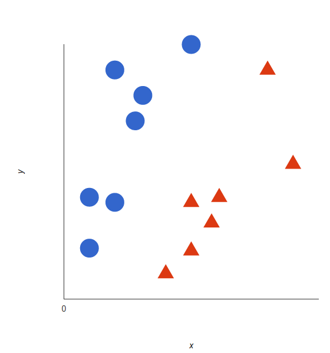{width=35%}

## Support Vector Machines
An **SVM** identifies the **decision boundary** or **hyperplane** (two dimensions: line) that best separates the tags:

\center
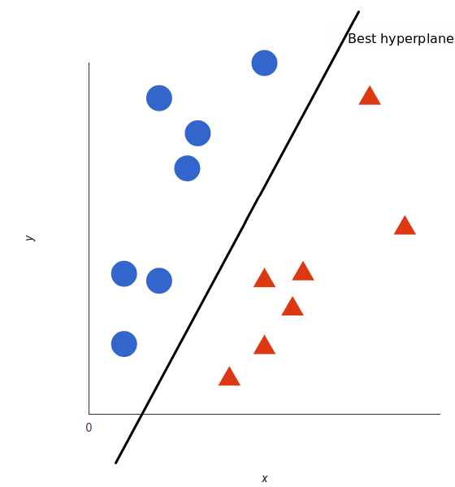{width=35%}


## Support Vector Machines
But, what exactly is the best hyperplane? For SVM, it’s the one that maximizes the margins from the data from both tags:
\center
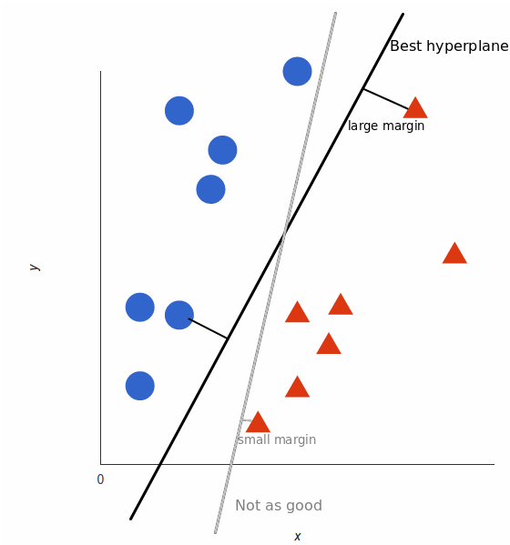{width=35%}

## A Look into SVM Methodology
\center
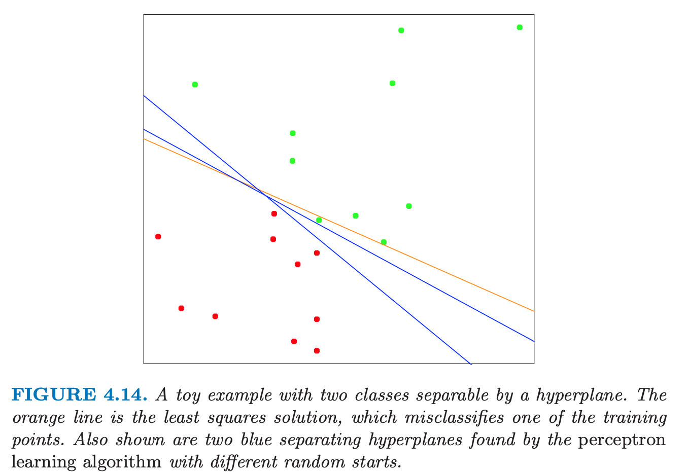{width=60%}

## A Look into SVM Methodology
\center
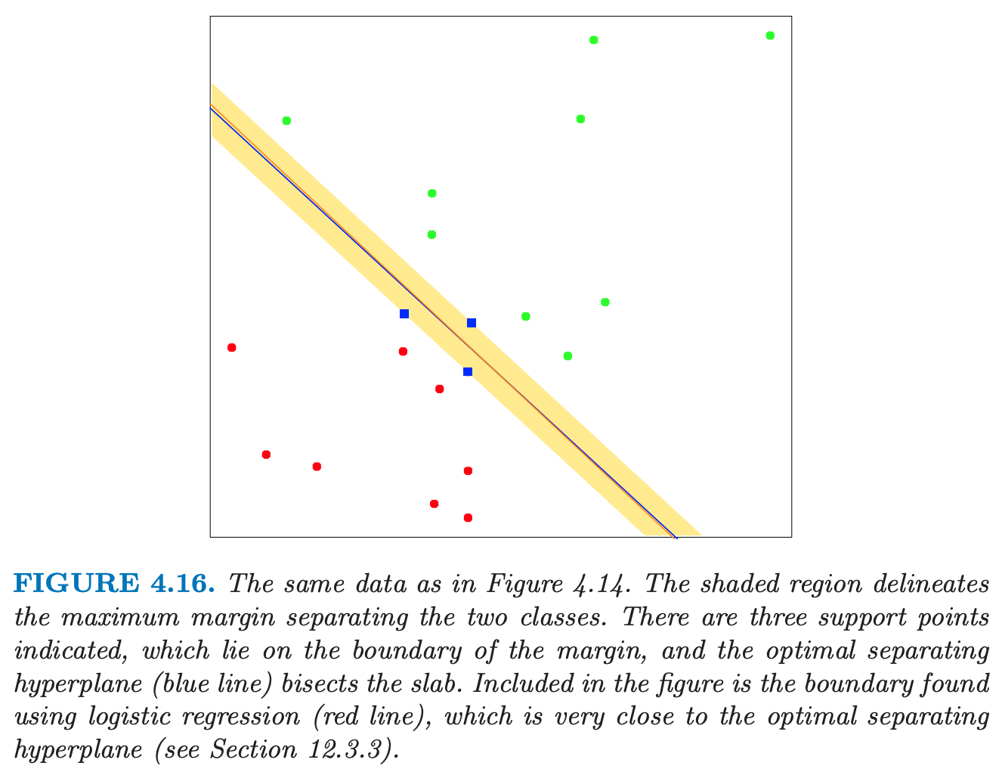{width=60%}


## A Look into SVM Methodology
\center
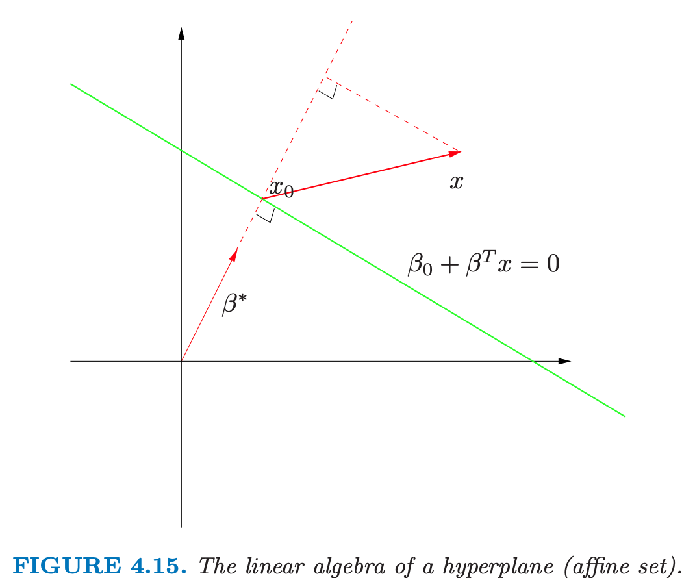{width=60%}


## A Look into SVM Methodology
\center
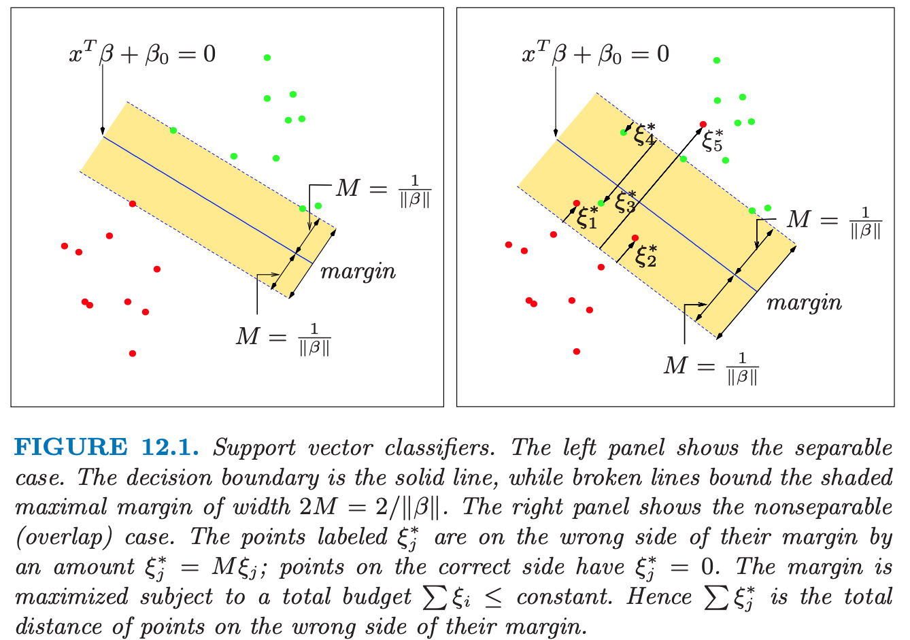{width=60%}


## Support Vector Machines in R
\Large
First generate some data in 2 dimensions, and make them a little separated:

```{r,eval=F, out.width="60%",fig.align='center'}
set.seed(10111)
x = matrix(rnorm(40), 20, 2)
y = rep(c(-1, 1), c(10, 10))
x[y == 1,] = x[y == 1,] + 1
plot(x, col = y + 3, pch = 19)
```

## Support Vector Machines in R

```{r,echo=F, out.width="70%",fig.align='center'}
set.seed(10111)
x = matrix(rnorm(40), 20, 2)
y = rep(c(-1, 1), c(10, 10))
x[y == 1,] = x[y == 1,] + 1
plot(x, col = y + 3, pch = 19)
```


## Support Vector Machines in R
We will use the **e1071** package which contains the svm function and make a dataframe of the data, turning $y$ into a factor variable.

\scriptsize
```{r,out.width="60%",fig.align='center'}
library(e1071)
dat = data.frame(x, y = as.factor(y))
svmfit = svm(y ~ ., data = dat, kernel = "linear", cost = 10, scale = FALSE)
print(svmfit)
```

<!--Printing the svmfit gives its summary. You can see that the number of support vectors is 6 - they are the points that are close to the boundary or on the wrong side of the boundary.-->

## Support Vector Machines in R

There's a plot function for SVM that shows the decision boundary<!--, as you can see below. It doesn't seem there's much control over the colors. It breaks with convention since it puts x2 on the horizontal axis and x1 on the vertical axis.-->

```{r,out.width="50%",fig.align='center'}
plot(svmfit, dat)
```

## Support Vector Machines in R
Or plotting it more cleanly:
```{r,include=F,echo=F}
make.grid = function(x, n = 75) {
  grange = apply(x, 2, range)
  x1 = seq(from = grange[1,1], to = grange[2,1], length = n)
  x2 = seq(from = grange[1,2], to = grange[2,2], length = n)
  expand.grid(X1 = x1, X2 = x2)
}
xgrid = make.grid(x)
```

```{r,echo=F,out.width="65%",fig.align='center'}
ygrid = predict(svmfit, xgrid)
plot(xgrid, col = c("red","blue")[as.numeric(ygrid)], pch = 20, cex = .2)
points(x, col = y + 3, pch = 19)
points(x[svmfit$index,], pch = 5, cex = 2)
```


## Support Vector Machines in R
Unfortunately, the svm function is not too friendly, in that you have to do some work to get back the linear coefficients. The reason is probably that this only makes sense for linear kernels, and the function is more general. So let's use a formula to extract the coefficients more efficiently. You extract $\beta$ and $\beta_0$, which are the linear coefficients.


```{r}
beta = drop(t(svmfit$coefs)%*%x[svmfit$index,])
beta0 = svmfit$rho
```


Now you can replot the points on the grid, then put the points back in (including the support vector points). Then you can use the coefficients to draw the decision boundary using a simple equation of the form:

$$\beta_0+x_1\beta_1+x_2\beta_2=0$$

## Support Vector Machines in R
Now plotting the lines on the graph:
\footnotesize
```{r,out.width="65%",fig.align='center' ,echo=F}
plot(xgrid, col = c("red", "blue")[as.numeric(ygrid)], pch = 20, cex = .2)
points(x, col = y + 3, pch = 19)
points(x[svmfit$index,], pch = 5, cex = 2)
abline(beta0 / beta[2], -beta[1] / beta[2])
abline((beta0 - 1) / beta[2], -beta[1] / beta[2], lty = 2)
abline((beta0 + 1) / beta[2], -beta[1] / beta[2], lty = 2)
```

## Support Vector Machines--Non-Linear Data
The prior examples were easy because the data were linearly separable. Often things aren’t that simple. Look at this case:

\center
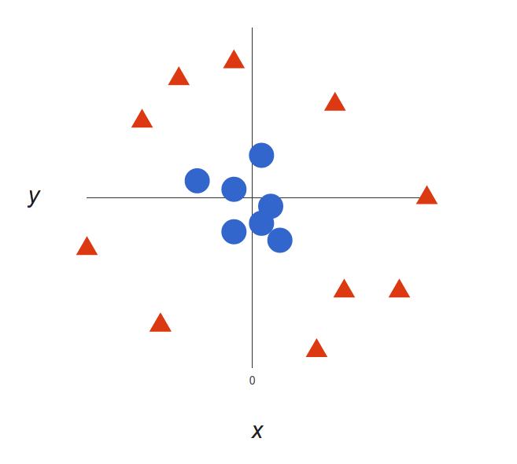{width=40%}

## Support Vector Machines
Here we will add a third dimension: z = x2 + y2 (you’ll notice that’s the equation for a circle!), and plot x and z. 

\center
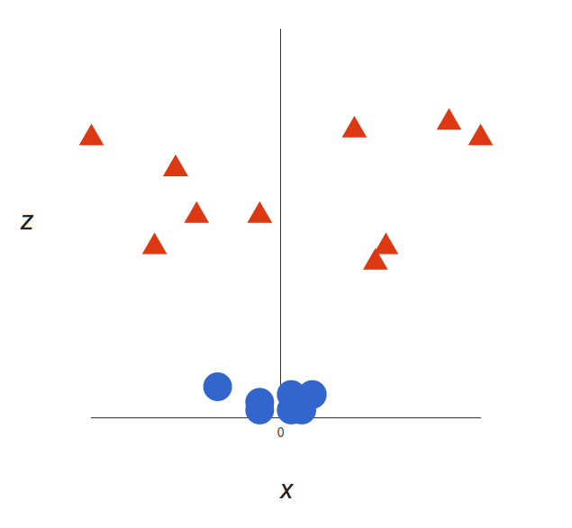{width=40%}

## Support Vector Machines
What can SVM do with this? Let’s see:

\hfil 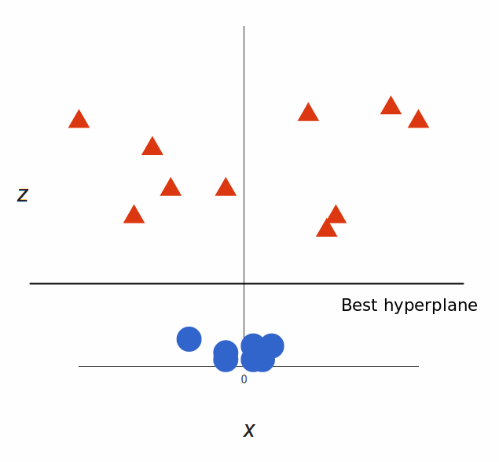{width=35%} \hfil

That’s great! Note that since we are in three dimensions now, the hyperplane is a plane parallel to the $x$ axis at a certain $z$ (let’s say $z$=1).

## Support Vector Machines
What’s left is mapping it back to two dimensions:

\hfil 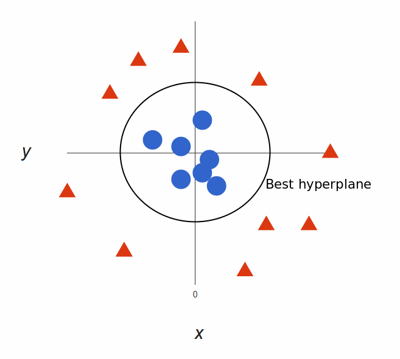{width=50%} \hfil

And there we go! Our decision boundary is a circumference of radius 1, which separates both tags using SVM.

## The "Kernel Trick"
\Large
Transformations are computationally expensive, but SVM doesn’t need the actual vectors, it only needs the dot products.


We can tell SVM to do its thing using the new dot product—we call this a **kernel function.**

## The "Kernel Trick"
\Large
This often called the _“kernel trick”_, which enlarges the feature space for a non-linear boundary between the classes.

Common types of kernels: _linear_, _polynomial_, and _radial basis_ kernels. 

Simply, these kernels transform our data to pass a linear hyperplane and thus classify our data.

## Support Vector Machines in R: Non-linear SVM
Now let's apply a non-linear (polynomial) SVM to our prior simulated dataset. 
\scriptsize
```{r,out.width="60%",fig.align='center'}
dat = data.frame(x, y = as.factor(y))
svmfit = svm(y ~ ., data = dat, kernel = "polynomial", cost = 10, scale = FALSE)
print(svmfit)
```


## Support Vector Machines in R: Non-linear SVM
Plotting the result:
```{r,out.width="65%",fig.align='center', echo=F}
ygrid = predict(svmfit, xgrid)
plot(xgrid, col = c("red","blue")[as.numeric(ygrid)], pch = 20, cex = .2)
points(x, col = y + 3, pch = 19)
points(x[svmfit$index,], pch = 5, cex = 2)
```

## Support Vector Machines in R: Non-linear SVM
\Large
Here is a more complex example from _Elements of Statistical Learning_, where the decision boundary needs to be non-linear and there is no clear separation. 
\scriptsize
```{r}
#download.file(
#  "http://www-stat.stanford.edu/~tibs/ElemStatLearn/datasets/ESL.mixture.rda", 
#  destfile='ESL.mixture.rda')
rm(x,y)
load(file = "ESL.mixture.rda")
attach(ESL.mixture)
names(ESL.mixture)
```

## Support Vector Machines in R: Non-linear SVM
Plotting the data:
```{r, echo=F, out.width="60%", fig.height=4.5, fig.width=6, fig.align='center'}
plot(x, col = y + 1)
```


## Support Vector Machines in R: Non-linear SVM
Now make a data frame with the response $y$, and turn that into a factor. We will fit an SVM with radial kernel.
\scriptsize
```{r}
dat = data.frame(y = factor(y), x)
fit = svm(factor(y) ~ ., data = dat, scale = FALSE, kernel = "radial", cost = 5)
print(fit)
```


## Support Vector Machines in R: Non-linear SVM

It's time to create a grid and  predictions. We use `expand.grid` to create the grid, predict each of the values on the grid, and plot them:
\scriptsize
```{r, echo=F, out.width="60%", fig.height=4.5, fig.width=6, fig.align='center'}
xgrid = expand.grid(X1 = px1, X2 = px2)
ygrid = predict(fit, xgrid)
plot(xgrid, col = as.numeric(ygrid), pch = 20, cex = .2)
points(x, col = y + 1, pch = 19)
```

## Support Vector Machines in R: Non-linear SVM

Plotting with a contour:
```{r, out.width="65%", fig.height=4.5, fig.width=6, fig.align='center', echo=F}
func = predict(fit, xgrid, decision.values = TRUE)
func = attributes(func)$decision

xgrid = expand.grid(X1 = px1, X2 = px2)
ygrid = predict(fit, xgrid)
plot(xgrid, col = as.numeric(ygrid), pch = 20, cex = .2)
points(x, col = y + 1, pch = 19)

contour(px1, px2, matrix(func, 69, 99), level = 0, add = TRUE, lwd=2)
```

## Advantages and Disadvantages of SVMs
\Large
**Advantages:**

* **High Dimensionality:** SVM is an effective tool in spaces where dimensionality is large.
* **Memory Efficiency:** Only a subset of the training points are used, so just these points need to be stored in memory.
* **Versatility:** Class separation is often highly non-linear. The ability to apply new kernels allows flexibility for the decision boundaries.

## Advantages and Disadvantages of SVMs
\Large
**Disadvantages:**

* **Kernel Selection:** SVMs are very sensitive to the choice of the kernel parameters. 
* **High dimensionality:** When the number of features for each object exceeds the number of training data samples, SVMs can perform poorly.
* **Non-Probabilistic:** The classifier works by placing objects above/below a classifying hyperplane, there is no direct probabilistic interpretation.

## SVM Nanostring

Remember the PCA dimension reduction of the TB Nanostring dataset. The points are colored based on TB status.

```{r, echo=F, out.width="50%", fig.height=4.5, fig.width=6}
TBnanostring <- readRDS("TBnanostring.rds")

pca_out <- prcomp(TBnanostring[,-1])
  
pca_reduction <- as.data.frame(pca_out$x)
pca_reduction$Condition <- as.factor(TBnanostring$TB_Status)

pca_reduction %>% ggplot(aes(x=PC1, y=PC2, color=Condition)) + 
    geom_point() + xlab("PC 1") + ylab("PC 2") + 
    theme(plot.title = element_text(hjust = 0.5)) + ggtitle("PCA Plot")
```


## SVM Nanostring
Now try an SVM on the PCs of the Nanostring data:
\scriptsize
```{r}
# use only the first 10 PCs
dat = data.frame(y = pca_reduction$Condition, pca_reduction[,1:2])
fit = svm(y ~ ., data = dat, scale = FALSE, kernel = "linear", cost = 10)
print(fit)
```

## SVM Nanostring
We can evaluate the predictor with a `Confusion matrix`:
\tiny
```{r}
library(caret)
confusionMatrix(dat$y,predict(fit,dat))
```


## SVM Nanostring
Plotting Nanostring data:
```{r,out.width="50%", fig.height=4.5, fig.width=6}
plot(fit,dat,PC2~PC1)
```

## SVM Nanostring

```{r,echo=F,out.width="75%", fig.height=4.5, fig.width=6}
make.grid = function(x, n = 75) {
  grange = apply(x, 2, range)
  x1 = seq(from = grange[1,1], to = grange[2,1], length = n)
  x2 = seq(from = grange[1,2], to = grange[2,2], length = n)
  tmp = expand.grid(X1 = x1, X2 = x2)
}
xgrid = make.grid(dat[,-1])
colnames(xgrid)<-colnames(dat[,-1])

ygrid = predict(fit, xgrid)
plot(xgrid, col = c("red","blue")[as.numeric(ygrid)], pch = 20, cex = .2)
points(dat[,2:3], col = dat[,1] , pch = 19)
```


## Session Info
\tiny
```{r session}
sessionInfo()
```
