```{r setup, include=FALSE}
library(knitr)
opts_chunk$set(echo = TRUE,
               out.width = "50%", 
               fig.align = "center")
library(caret)
library(tidyverse)
img_path <- "nnFigs/"
```


##
\vfill
\begin{center}
{\huge\itshape ``Biology / Biomedicine is a Data Science.''}

\vspace{0.6cm}

{\large --- W. Evan Johnson}

\vspace{0.4cm}

{\large\itshape Addendum: don't avoid the math!}
\end{center}
\vfill

##
\vfill
\begin{center}
{\huge\itshape ``With great power comes great responsibility.''}

\vspace{0.8cm}

{\large --- Uncle Ben, \emph{Spider-Man}}
\end{center}
\vfill

## A Quick Map of "AI"
\Large
Where do neural networks fit in the broader AI landscape?

- **Narrow AI** (all AI today): does one specific task well --- Face ID, spam filters, recommendations, Google Maps, ChatGPT
- **Generative AI**: creates new content from learned patterns --- text, images, music, video, voice
- **Agentic AI** (emerging): takes actions, makes plans, and uses tools to accomplish goals --- schedules meetings, sends email, runs tasks automatically

## A Quick Map of "AI"
\Large

- **Artificial General Intelligence (AGI)**: human-level reasoning across many tasks --- **theoretical; does not exist** (movies exaggerate it)
- **Artificial Super Intelligence (ASI)**: hypothetical intelligence that would *surpass* humans across virtually all domains --- **also does not exist**

\vspace{0.3cm}
Everything we build today --- including the neural networks in this lecture --- is **Narrow AI**.

## Real (Human) Intelligence
\Large
The ability to think, choose, create, understand meaning, and act with moral responsibility:

- **Agency** --- we choose
- **Moral judgment** --- right vs. wrong
- **Creativity** --- truly new ideas
- **Understanding meaning**
- **Empathy and relationships**
- **Spiritual capacity**

##
\vfill
\begin{center}
{\huge\itshape ``AI will not replace us, it will amplify us.''}

\vspace{0.8cm}

{\large --- Pedro Domingos}
\end{center}
\vfill

## Introduction to Neural Networks
\Large
The brain has billions of neurons, each a simple processor, wired into a **biological neural network** that passes electrical signals from neuron to neuron:

- **Dendrites** --- receive input signals
- **Soma** (cell body) --- sums the inputs
- **Axon $\rightarrow$ synapses** --- pass the output on to other neurons

## Introduction to Neural Networks
\center
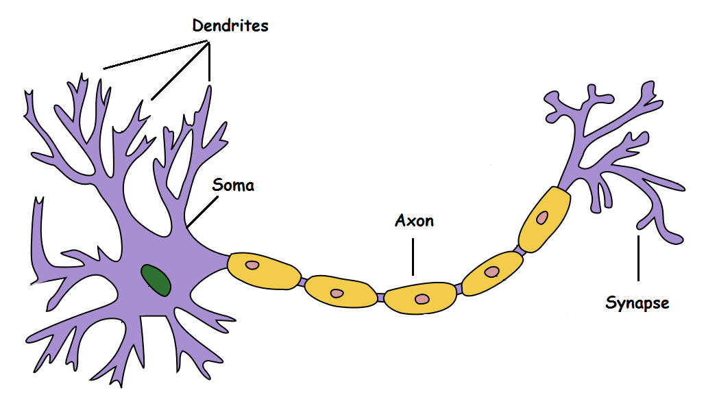{width=85%}

## Introduction to Neural Networks
\Large
**McCulloch \& Pitts (1943--44)** --- the first mathematical model of a neuron:

- Takes inputs, processes them, and returns an output (thresholds + weights)
- **No layers and no training rule**
- Showed a neural net could *in principle* compute any function a computer could --- framing the brain as a computing device

## Introduction to Neural Networks
The McCulloch-Pitts neuron model looked something like this:
\center
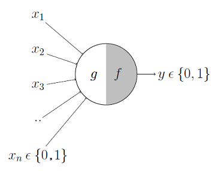{width=50%}

## Introduction to Neural Networks
\Large
The **Perceptron** --- the first *trainable* neural network:

- **1957 (Rosenblatt):** one layer of adjustable weights and thresholds, between input and output layers
- **1959 (Minsky \& Papert):** showed common computations were *impractically slow* on perceptrons --- research stalls

## Introduction to Neural Networks
\Large
The Perceptron model looked something like this:
\center
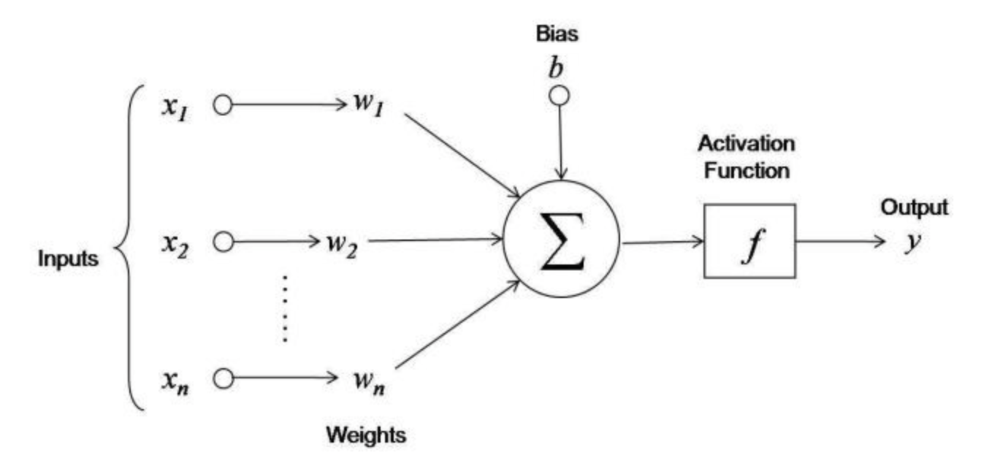{width=80%}

## Introduction to Neural Networks
\Large
The pieces of a neuron:

- **Inputs** $x_1,\ldots,x_N$ --- the predictors
- **Weights** $w_1,\ldots,w_N$ **and bias** $b$ --- adjustable parameters, summed into the net input
- **Activation function** --- maps that sum to the output

Learning = adjusting the weights and bias from the data.

## Introduction to Neural Networks
\Large
The **activation function** maps a neuron's weighted input to its output --- giving the network its **non-linearity** (often just one line of code):

- **Identity** --- output = input (linear)
- **Binary step** --- on/off above a threshold (classifier)
- **Sigmoid / tanh** --- smooth S-curve for probabilities
- **ReLU** --- $\max(0,x)$; the modern default

## Introduction to Neural Networks
\center
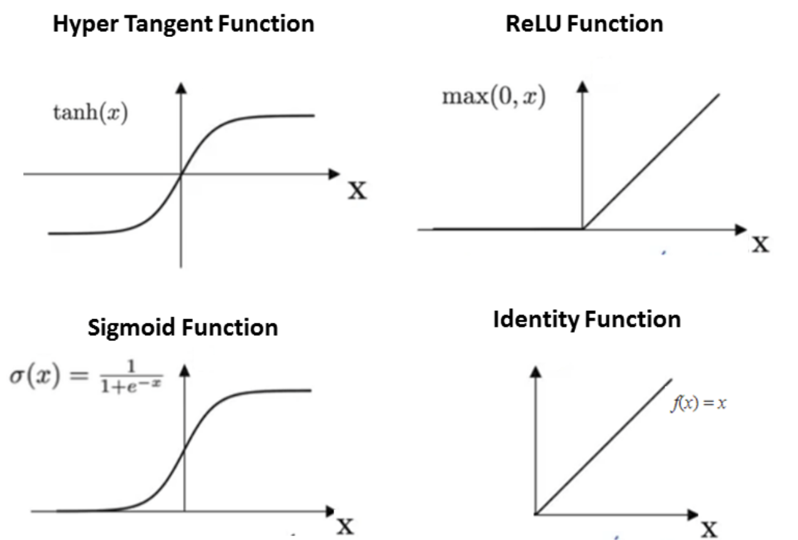{width=60%}

## Introduction to Neural Networks
Modern **neural networks** are algorithms comprising multiple layers of connected input/output units (neurons) in which each connection has a weight associated with it. 
\center
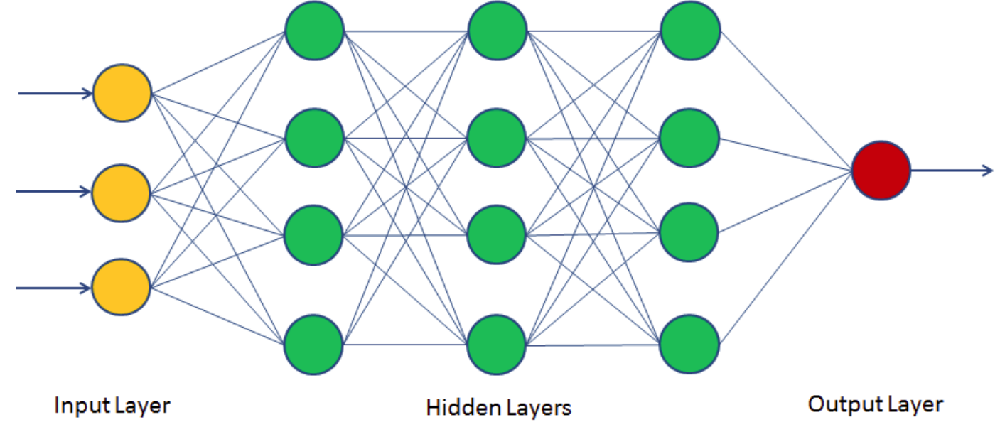{width=70%}

## How Does a Neural Network Learn?
\Large
Training a network means finding the **weights** that make its predictions match the data. Three ingredients:

1. A **loss** \( \ell(y, \hat{y}) \): how wrong is the prediction?
2. **Backpropagation**: how does each weight affect the loss?
3. **Gradient descent**: nudge each weight to reduce the loss.

##
\vfill
\begin{center}
{\huge\itshape ``AI is not magic; it's math.''}

\vspace{0.8cm}

{\large --- Peter Norvig}
\end{center}
\vfill

## The Chain Rule
\center
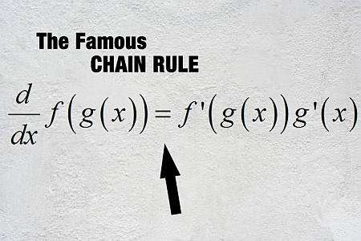{width=70%}

## The Chain Rule
\Large
A neural network is just **functions composed inside functions**. The derivative of a composition multiplies the derivatives of each layer:
\center
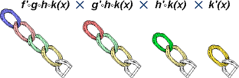{width=95%}

## Backpropagation
\Large
The chain rule lets us send the error **backward** through the network and compute the gradient of the loss with respect to **every weight**:
\center
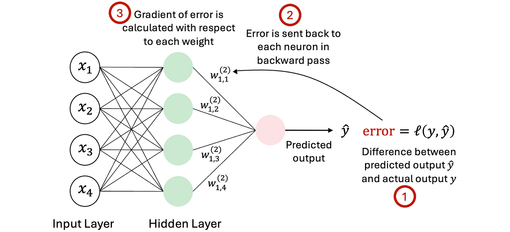{width=80%}

## Gradient Descent
\Large
Each step adjusts the weights in the direction that **decreases the loss**, iterating until it converges to a minimum:
\center
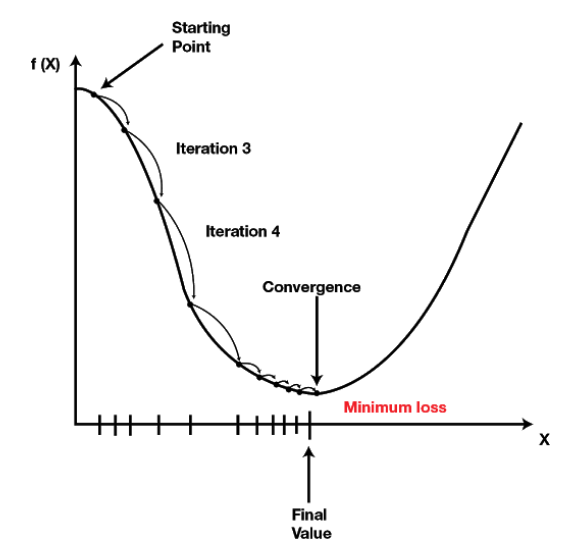{height=58%}

## Multilayer Perceptron Neural Network in R
Suppose we have students' technical knowledge (TKS), communication skill score (CSS), and placement status (Placed):

```{r}
TKS=c(20,10,30,20,80,30)
CSS=c(90,20,40,50,50,80)
Placed=c(1,0,0,0,1,1)
df=data.frame(TKS,CSS,Placed)
```

## Multilayer Perceptron Neural Network in R
```{r}
knitr::kable(df)
```


## Multilayer Perceptron Neural Network in R
\Large
Fit the multilayer perceptron neural network:
\footnotesize
```{r, fig.align="center", out.width="80%"}
suppressPackageStartupMessages(library(neuralnet))
set.seed(0)
nn=neuralnet::neuralnet(Placed~TKS+CSS,data=df, hidden=3,
             act.fct = "logistic", linear.output = FALSE)
names(nn)
```                

## Multilayer Perceptron Neural Network in R
\Large
We can plot or neural network:
```{r, fig.height=4, fig.width=8, fig.align='center'}
plot(nn)
```

\center
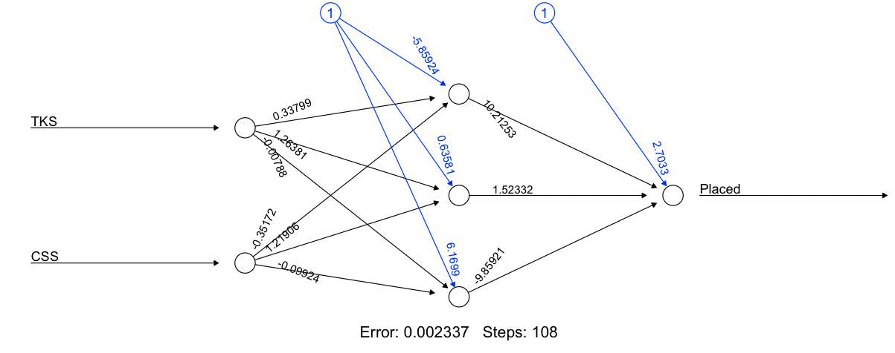{width=80%}

## Multilayer Perceptron Neural Network in R
\Large
Creating a test set:
```{r}
TKS=c(30,40,85)
CSS=c(85,50,40)
test=data.frame(TKS,CSS)
```

## Multilayer Perceptron Neural Network in R
\Large
```{r}
knitr::kable(test)
```

## Multilayer Perceptron Neural Network in R
\Large
Prediction using neural network:
```{r}
Predict=compute(nn,test)
Predict$net.result
```

## Multilayer Perceptron Neural Network in R
\Large
Converting probabilities into binary classes setting threshold level 0.5:
```{r}
prob <- Predict$net.result
pred <- ifelse(prob>0.5, 1, 0)
pred
```


## Multilayer Perceptron Neural Network in R
\Large
Now, using the `iris` dataset: 
```{r}
set.seed(0)
nn_iris <- neuralnet(Species ~ ., data=iris, hidden=3)
```


## Multilayer Perceptron Neural Network in R
\Large
Plotting the Neural Network:  
```{r}
plot(nn_iris)
```

\center
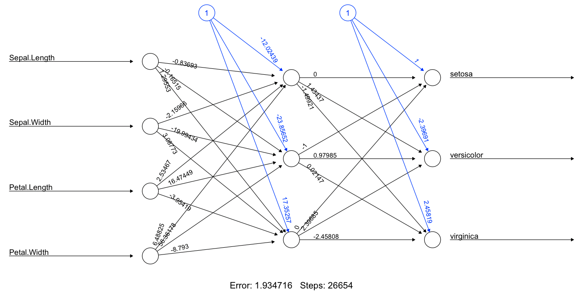{width=70%}


## Multilayer Perceptron Neural Network in R
\Large
Now, doing the same thing using `caret':
\normalsize
```{r}
set.seed(0)
nn_caret <- caret::train(Species~., data = iris, 
                         method = "nnet", linout = TRUE, 
                         trace = FALSE)
ps <- predict(nn_caret, iris)
confusionMatrix(ps, iris$Species)$overall["Accuracy"]
```

## Multilayer Perceptron Neural Network in R
\Large
Plotting the `caret' neural network:
```{r, fig.height=8, fig.width=12, fig.align='center', out.width="60%"}
NeuralNetTools::plotnet(nn_caret)  
```


## Introduction to Neural Networks
\Large
Modern neural networks **learn by example** from training data --- adjusting weights across a network of artificial neurons to capture **non-linear** patterns.

- Best for tasks easy for humans but hard to program: **pattern recognition**
- Applications: image classification (cats vs. dogs), OCR, object detection

## Introduction to Neural Networks
\Large
Two common architectures:

- **Feedforward** --- non-recursive; signals travel one way, layer to layer, toward the output
- **Feedback (recurrent)** --- contains loops; signals travel in both directions

## Recurrent Neural Networks (RNNs)
\Large
_Feedback neural networks_ contain cycles. Signals travel in both directions by introducing loops in the network. Feedback neural networks are also known as _recurrent neural networks_. 
\center
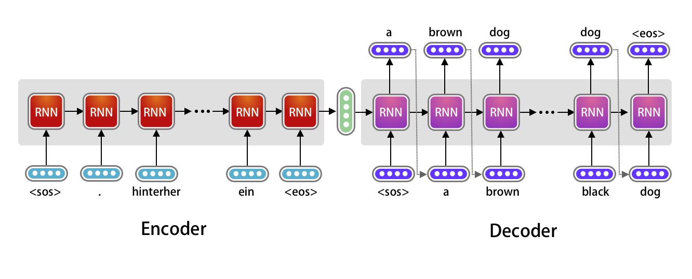{width=90%}


## Introduction to Neural Networks
\Large
There are many other formulations of **deep learning** neural networks:

* Perceptron/Multilayer Perceptron
* Feedforward Neural Network
* Recurrent Neural Network
* Convolutional Neural Network
* Radial Basis Functional Neural Network
* LSTM – Long Short-Term Memory
* Sequence to Sequence Models
* Modular Neural Network

## Convolutional Neural Networks
\Large
A **CNN** (ConvNet) is a neural network specialized for **grid-like data** such as images:

- **Shared-weight filters (kernels)** slide across the input $\rightarrow$ **feature maps**
- **Translation-invariant**: finds a pattern anywhere in the image
- Builds complexity hierarchically --- a **regularized** form of an MLP

## Convolutional Neural Networks
\Large
- **Filters are learned automatically** --- no hand-engineering
- Applications: image \& video recognition, classification \& segmentation, medical imaging, NLP, time series

\center
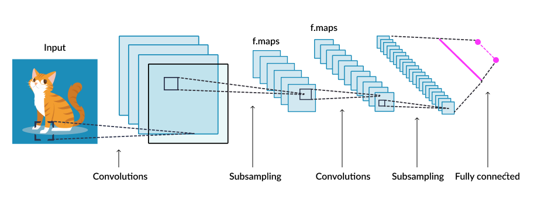{width=90%}


## Convolutional Neural Networks
\Large
Maximum filter example (or **pooling**): 
\center
{width=70%}

## Convolutional Neural Networks
\Large
Sliding (overlapping) filter example (**kernel**, **stride** and **padding**): 
\center
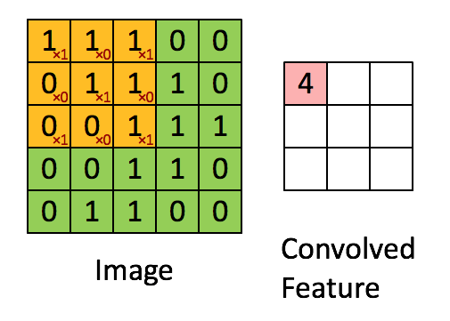{width=49%} 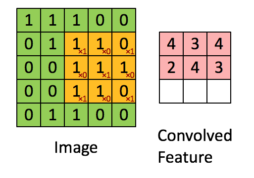{width=49%}

## Convolutional Neural Networks
\Large
Now applying this to cats: 
\center
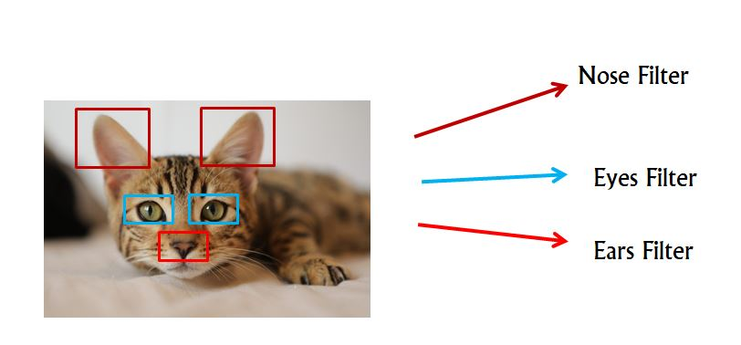{width=80%}

## Convolutional Neural Networks
\Large
More realistically:
\center
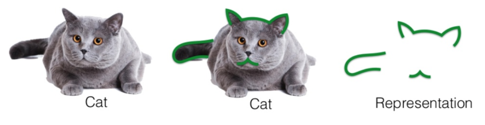

## Convolutional Neural Networks
\Large
And as a classifier:
\center
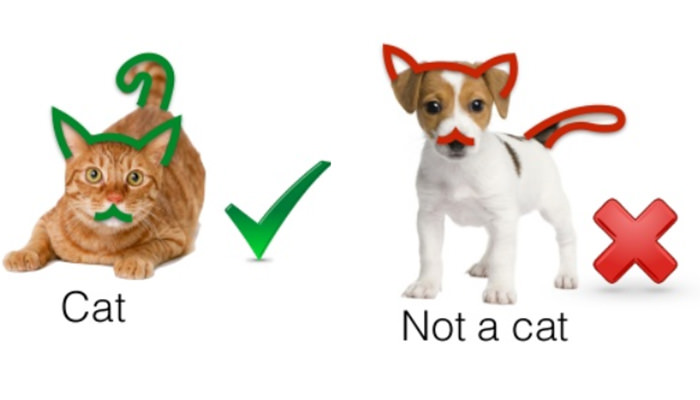{width=80%}


## Recurrent Neural Networks
\Large
- A type of neural network for **sequential data**
- Maintains **memory of previous inputs** using hidden states
- Commonly used for:
  - Natural Language Processing (NLP)
  - Time Series Forecasting
  - Speech Recognition

## Why Not Feedforward Networks?
\Large
- Standard neural networks assume **independent inputs**
- But sequences (like text) have **temporal dependencies**
- Example:
  - Sentence: *"The cat sat on the ___."*
  - You need previous words to predict the blank

## RNN Architecture
\Large
- Loops over time: same weights applied at each time step
- Input at time \( t \): \( x_t \)
- Hidden state: \( h_t = f(W x_t + U h_{t-1} + b) \)
- Output: \( y_t = g(V h_t + c) \)

---

## Diagram of RNN (Unrolled)
\center


## Challenges of RNNs
\Large
- Vanishing/exploding gradients during training
- Hard to learn long-term dependencies
- Solutions:
    - LSTM (Long Short-Term Memory)
    - GRU (Gated Recurrent Unit)

## RNN for Language Translation
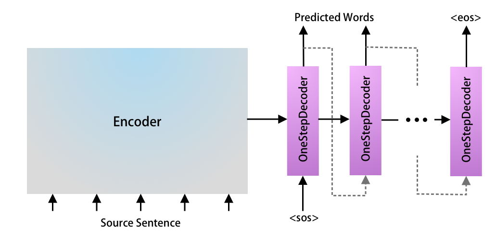

## RNN for Language Translation
\center


## RNN for Language Translation
\center
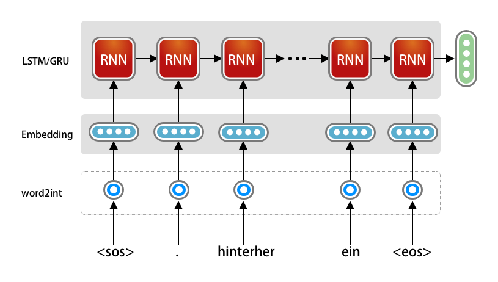{width=80%}

## RNN for Language Translation
\center
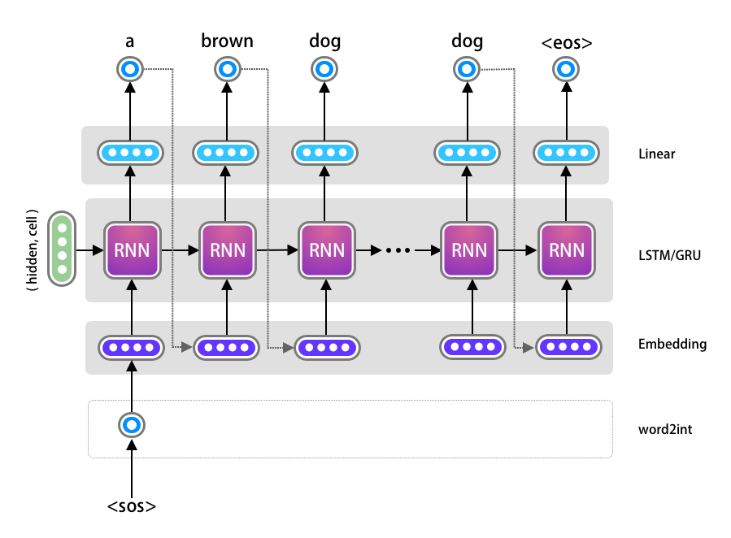{height=62%}

## From RNNs to Transformers
\Large
- RNNs process inputs **sequentially** – limits parallelism
- Transformers process the **entire sequence at once**
- Introduced in **“Attention is All You Need”** (Vaswani et al., 2017)

## Transformers: A Very Advanced Autocomplete
\Large
**GPT** = **G**enerative **P**retrained **T**ransformer. At its core, it just predicts the next word:

- You type a prompt
- The model looks at **all** the words at once
- It assigns **probabilities** to possible next words
- It picks a likely next word --- then repeats, again and again

\vspace{0.2cm}
ChatGPT is, in essence, a *very advanced autocomplete.*

## Transformers: Encoder--Decoder
\center
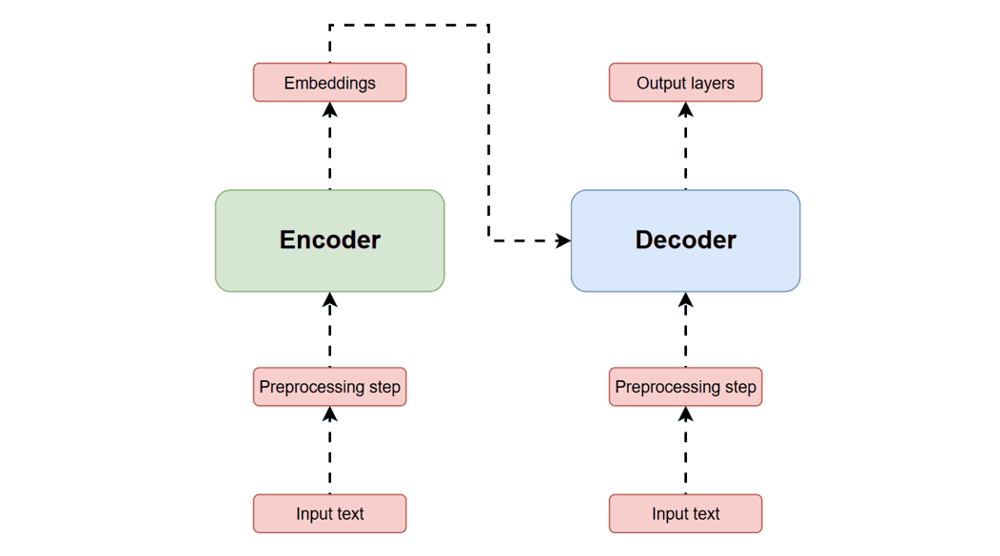{width=80%}

## Key Idea: Attention
\Large
- Attention allows the model to **focus on relevant parts** of the input
- Computes attention scores between all pairs of tokens
- Example: In translation, aligns source and target words

## Transformer Architecture
\Large
- Consists of **Encoder** and **Decoder** stacks
- Each block has:
  - Multi-head Self-Attention
  - Feedforward Neural Network
  - Residual connections & Layer normalization

## Self-Attention (Scaled Dot Product)
\Large
- For queries \( Q \), keys \( K \), values \( V \):
\[
\text{Attention}(Q, K, V) = \text{softmax} \left( \frac{QK^T}{\sqrt{d_k}} \right) V
\]

- Learns how each token relates to others in the sequence

## Multi-Head Attention
\Large
- Multiple attention “heads” allow the model to learn different relationships
- Outputs from each head are concatenated and linearly transformed

## Positional Encoding
\Large
- Transformers have no recurrence or convolution
- Positional encoding injects **order information** into the input embeddings
- Common method: use sine/cosine functions of different frequencies

## Advantages of Transformers
\Large
- **Highly parallelizable** – faster training
- Better at learning **long-range dependencies**
- Backbone of modern NLP: BERT, GPT, T5, etc.

## Transformer Architecture
\center
{height=70%}


## Session Info
\tiny
```{r session}
sessionInfo()
```
