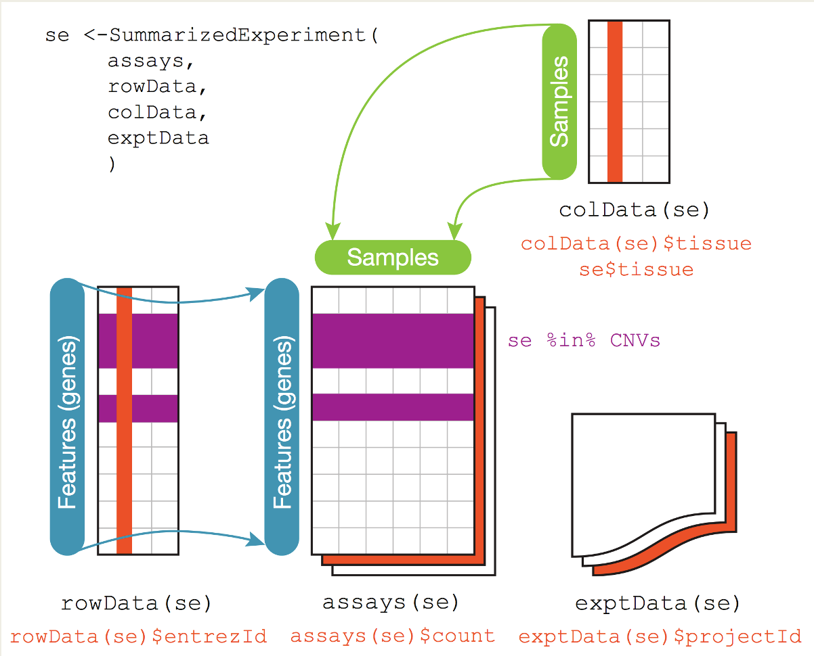

## Set up: load these packages!
```{r setup, include=F}
suppressMessages({
  library(umap)
  library(DT)
  library(tidyverse)
  library(SummarizedExperiment)
  library(TBSignatureProfiler)
})
```

```{r, eval=F}
library(umap)
library(DT)
library(tidyverse)
library(SummarizedExperiment)
library(TBSignatureProfiler)
```

## Data Structures
A data structure is a particular way of organizing data in a computer so that it can be used effectively. The idea is to reduce the space and time complexities of different tasks.

Data structures in R programming are tools for holding multiple values, variables, and sometimes functions

**Please think very carefully about the way you manage and store your data!** This can make your life much easier and make your code and data cleaner and more portable!

### Data Frames
A large proportion of data analysis challenges start with data stored in a data frame. For example, we stored the data for our motivating example in a data frame. You can access this dataset by loading `TBNanostring.rds` object in R:

```{r}
TBnanostring <- readRDS("TBnanostring.rds")
```

In RStudio we can view the data with the `View` function:

```{r, eval=F}
View(TBnanostring)
```

Or in RMarkdown you can use the `datatable` function from the `DT` package:

```{r}
datatable(TBnanostring)
```

You will notice that the TB status is found in the first column of the data frame, followed by the genes in the subsequent columns. The rows represent each individual patient. 

### Advanced Data Structures

There are advanced R data structures, __S3__ and __S4__ class objects, that can facilitate object orientated programming. One useful example of an S4 class data structure is the __SummarizedExperiment__ object. 

\center
{height=70%}


## Dimension Reduction {.tabset}
### PCA Example
Here is the code for applying PCA to the Nanostring dataset:

```{r}
pca_out <- prcomp(TBnanostring[,-1])
names(pca_out)
```

Here is a summary of the explained variation from the PCA:
```{r}
round(pca_out$sdev^2/sum(pca_out$sdev^2),3)
```

And the cumulative variation explained:
```{r}
round(cumsum(pca_out$sdev^2)/sum(pca_out$sdev^2),3)
```

Now we will make a dataframe with the PCs for later use!
```{r}
pca_reduction <- as.data.frame(pca_out$x)
pca_reduction$Condition <- as.factor(TBnanostring$TB_Status)
datatable(pca_reduction)
```

### UMAP Example
```{r}
set.seed(0) ## need to set the seed or results might be different
umap_out <- umap(TBnanostring[,-1])
names(umap_out)
```

Now we will make a dataframe with the UMAP results for later use!
```{r}
umap_reduction <- as.data.frame(umap_out$layout)
umap_reduction$Class <- as.factor(TBnanostring$TB_Status)
datatable(umap_reduction)
```

## Visualizing data using `ggplot2` {.tabset}
Below is a step-by-step tutorial for making PCA and UMAP plots using `ggplot2`. 

### PCA Example {.tabset}
#### Step 0
We want to make the following plot using `ggplot2`.
```{r, echo=F}
## Read in the data
TBnanostring <- readRDS("TBnanostring.rds")

## Apply PCA
pca_out <- prcomp(TBnanostring[,-1])

## Make a dataframe with the results for plotting
pca_reduction <- as.data.frame(pca_out$x)
pca_reduction$Condition <- as.factor(TBnanostring$TB_Status)

## Plot results with ggpplot
pca_reduction %>% ggplot() + 
  geom_point(aes(x=PC1, y=PC2, color=Condition), shape=1) + 
  xlab("PC 1") + ylab("PC 2") + ggtitle("PCA Plot") +
  theme(plot.title = element_text(hjust = 0.5))
```

#### Step 1
```{r}
## Read in the data
TBnanostring <- readRDS("TBnanostring.rds")
```

#### Step 2
```{r}
## Read in the data
TBnanostring <- readRDS("TBnanostring.rds")

## Apply PCA
pca_out <- prcomp(TBnanostring[,-1])
```

#### Step 3
```{r}
## Read in the data
TBnanostring <- readRDS("TBnanostring.rds")

## Apply PCA
pca_out <- prcomp(TBnanostring[,-1])

## Make a dataframe with the results for plotting
pca_reduction <- as.data.frame(pca_out$x)
pca_reduction$Condition <- as.factor(TBnanostring$TB_Status)
```

#### Step 4
```{r}
## Read in the data
TBnanostring <- readRDS("TBnanostring.rds")

## Apply PCA
pca_out <- prcomp(TBnanostring[,-1])

## Make a dataframe with the results for plotting
pca_reduction <- as.data.frame(pca_out$x)
pca_reduction$Condition <- as.factor(TBnanostring$TB_Status)

## Initialize the plot
pca_reduction %>% ggplot()
```

#### Step 5
```{r}
## Read in the data
TBnanostring <- readRDS("TBnanostring.rds")

## Apply PCA
pca_out <- prcomp(TBnanostring[,-1])

## Make a dataframe with the results for plotting
pca_reduction <- as.data.frame(pca_out$x)
pca_reduction$Condition <- as.factor(TBnanostring$TB_Status)

## Add your geometry layer with x and y aesthetics
pca_reduction %>% ggplot() + 
  geom_point(aes(x=PC1, y=PC2)) 
```

#### Step 6
```{r}
## Read in the data
TBnanostring <- readRDS("TBnanostring.rds")

## Apply PCA
pca_out <- prcomp(TBnanostring[,-1])

## Make a dataframe with the results for plotting
pca_reduction <- as.data.frame(pca_out$x)
pca_reduction$Condition <- as.factor(TBnanostring$TB_Status)

## Change the shape of the points
pca_reduction %>% ggplot() + 
  geom_point(aes(x=PC1, y=PC2), shape=1)  
```


#### Step 7
```{r}
## Read in the data
TBnanostring <- readRDS("TBnanostring.rds")

## Apply PCA
pca_out <- prcomp(TBnanostring[,-1])

## Make a dataframe with the results for plotting
pca_reduction <- as.data.frame(pca_out$x)
pca_reduction$Condition <- as.factor(TBnanostring$TB_Status)

## Change color of points (add a mapping aesthetic) 
pca_reduction %>% ggplot() + 
  geom_point(aes(x=PC1, y=PC2, color=Condition), shape=1)
```

#### Step 8
```{r}
## Read in the data
TBnanostring <- readRDS("TBnanostring.rds")

## Apply PCA
pca_out <- prcomp(TBnanostring[,-1])

## Make a dataframe with the results for plotting
pca_reduction <- as.data.frame(pca_out$x)
pca_reduction$Condition <- as.factor(TBnanostring$TB_Status)

## Add labels, title, and theme
pca_reduction %>% ggplot() + 
  geom_point(aes(x=PC1, y=PC2, color=Condition), shape=1) + 
  xlab("PC 1") + ylab("PC 2") + ggtitle("PCA Plot") +
  theme(plot.title = element_text(hjust = 0.5))  
```


### UMAP Example {.tabset}
Here is the final UMAP plot
```{r}
## Read in data
TBnanostring <- readRDS("TBnanostring.rds")

## Apply UMAP reduction
set.seed(0)
library(umap)
umap_out <- umap(TBnanostring[,-1])

## Make dataframe for plotting in tidy format
umap_reduction <- as.data.frame(umap_out$layout)
umap_reduction$Condition <- as.factor(TBnanostring$TB_Status)

## Plot results with ggpplot
umap_reduction %>% ggplot() + 
  geom_point(aes(x=V1, y=V2, color=Condition), shape=1) + 
  xlab("UMAP 1") + ylab("UMAP 2") + ggtitle("UMAP Plot") +
  theme(plot.title = element_text(hjust = 0.5))  
```

## Visualization and Dimension reduction
Now using an example dataset from: [Verma, et al., 2018](https://bmcinfectdis.biomedcentral.com/articles/10.1186/s12879-018-3127-4)
```{r}
## read in data
counts <- read.table("features_combined.txt", 
  sep="\t", header=T, row.names=1)
meta_data <- read.table("hivtb_SRR_metadata.txt",
  sep="\t", header=T, row.names=1)

## The count columns are named by SampleID, so use that as the row identifier
rownames(meta_data) <- meta_data$SampleID

## Reorder rows of meta data to match columns of count data
meta_data <- meta_data[match(colnames(counts),rownames(meta_data)),]


```

Using this dataset, please do the following: 

1.\ Make a `SummarizedExperiment` object named `se_hivtb`.

2.\ Generate a log counts per million assay (hint: use `TBSignareProfiler::mkAssay()`).

```{r, include=F}
se_hivtb <- SummarizedExperiment(assays=list(counts=counts),
                     colData = meta_data)

## Make log counts, counts per million (cpm), logcpm
se_hivtb <- mkAssay(se_hivtb, log = TRUE, 
                     counts_to_CPM = TRUE)
assays(se_hivtb)
```

3.\ Generate a Principal Components Analysis (PCA) plot for these data

```{r, include=F}
pca_out <- prcomp(t(assay(se_hivtb,"log_counts_cpm")))
  
pca_plot <- as.data.frame(pca_out$x)
pca_plot$Disease <- as.factor(se_hivtb$disease_status)

g <- pca_plot %>% ggplot(aes(x=PC1, y=PC5, color=Disease)) +
  geom_point(size=1.5) + xlab("PCA1") + ylab("PCA5") +
  theme(plot.title = element_text(hjust = 0.5)) +
  ggtitle("PCA Plot")

plot(g)
```

4.\  Generate a Uniform Manifold Approximation and Projection (UMAP) plot for these data

```{r, include=F}
set.seed(1)
umap_out <- umap(t(assay(se_hivtb,"log_counts_cpm")))

umap_plot <- as.data.frame(umap_out$layout)
umap_plot$Disease <- as.factor(se_hivtb$disease_status)

g <- umap_plot %>% ggplot(aes(x=V1, y=V2, color=Disease)) +
  geom_point(size=1.5) + xlab("UMAP1") + ylab("UMAP2") +
  theme(plot.title = element_text(hjust = 0.5)) +
  ggtitle("UMAP Plot")

plot(g)
```

5.\  Conduct Differential Expression using DESeq2, EdgeR, and Limma. Create differential expression gene lists for each and compare. Make a Heatmap of your DEGs.

```{r, include=F, message=FALSE, warning=FALSE}
suppressMessages({
  library(edgeR)
  library(DESeq2)
  library(limma)
  library(ComplexHeatmap)
})

## Compare TB-HIV vs HIV: subset to those two groups (drop TB-HIV-ART)
keep <- meta_data$disease_status %in% c("TB-HIV", "HIV")
counts_sub <- counts[, keep]
meta_sub <- meta_data[keep, ]
## HIV as the reference level, so a positive logFC means up in TB-HIV
meta_sub$disease_status <- factor(meta_sub$disease_status,
                                  levels = c("HIV", "TB-HIV"))
group <- meta_sub$disease_status
counts_filt <- counts_sub[rowSums(counts_sub) > 100, ]
design <- model.matrix(~group)

## ---- edgeR (negative binomial GLM, quasi-likelihood F-test) ----
dge <- DGEList(counts = counts_filt, group = group)
dge <- calcNormFactors(dge)                 ## TMM normalization
dge <- estimateDisp(dge, design)            ## common/trended/tagwise dispersion
fit_edger <- glmQLFit(dge, design)
qlf <- glmQLFTest(fit_edger, coef = 2)       ## coef 2 = TB-HIV vs HIV
edger_top <- rownames(topTags(qlf, n = 100))

## ---- DESeq2 (negative binomial GLM) ----
dds <- DESeqDataSetFromMatrix(countData = counts_filt,
                              colData = meta_sub,
                              design = ~disease_status)
dds <- DESeq(dds)
res <- results(dds, contrast = c("disease_status", "TB-HIV", "HIV"))
deseq_top <- rownames(res[order(res$padj), ])[1:100]

## ---- limma-voom (mean-variance weighting + linear models) ----
v <- voom(dge, design)                      ## reuse edgeR's normalized DGEList
fit_limma <- lmFit(v, design)
fit_limma <- eBayes(fit_limma)
limma_top <- rownames(topTable(fit_limma, coef = 2, number = 100))

## ---- Compare the three DEG lists ----
deg_lists <- list(edgeR = edger_top, DESeq2 = deseq_top, limma = limma_top)
sapply(deg_lists, length)                    ## genes per method
common_degs <- Reduce(intersect, deg_lists)  ## shared across all three
length(common_degs)

## ---- Heatmap of DEGs (TB-HIV vs HIV samples only) ----
se_sub <- se_hivtb[, keep]
mat <- as.matrix(assay(se_sub, "log_counts_cpm"))[deseq_top, ]
mat <- t(scale(t(mat)))                       ## scale gene expression by row
df <- data.frame(Disease = colData(se_sub)$disease_status)
ha <- HeatmapAnnotation(df = df,
        col = list(Disease = c("TB-HIV" = "Red",
                               "HIV" = "Blue")))
Heatmap(mat, show_row_names = FALSE, show_column_names = FALSE,
        top_annotation = ha)
```


## Session Info
```{r session}
sessionInfo()
```
